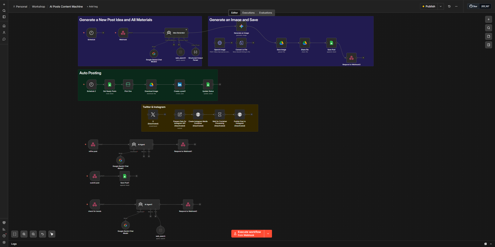

# 🚀 Morafiqy Content Engine: Headless AI Social Media Backend

| Field        | Details                          |
|-------------|----------------------------------|
| **Date**     | December 2025                    |
| **Status**   | ✅ Completed                       |
| **Role**     | AI Engineer                      |
| **Tech Stack** | n8n, Google Gemini, OpenAI (GPT-Image-1.5), Tavily Search, LinkedIn API, Instagram Graph API, Google Drive, Google Sheets |

---

## Overview

Morafiqy Content Engine is a headless AI social media content system that automates end-to-end post creation — from trend discovery and content generation to image creation and multi-platform publishing. Orchestrated entirely within n8n with a decoupled frontend, it features a Human-in-the-Loop architecture for quality control before any content goes live.

## Features

- **AI-Powered Trend Discovery** — Fetches the latest AI and tech trends via Tavily search to generate timely, relevant post ideas
- **Executive Content Generation** — Produces professional Arabic/English social media posts with a "Hook, Insight, Value, CTA" structure tailored for CEO-level audiences
- **AI Image Creation** — Generates on-brand visuals using OpenAI GPT-Image-1.5 or Google Gemini with brand-specific styling rules (Deep Tech Blue / Teal palette)
- **Human-in-the-Loop Review** — All generated content is queued in Google Sheets for manual review before publishing; users can request revisions via a refine webhook
- **Multi-Platform Publishing** — Auto-publishes approved posts to LinkedIn and Instagram on schedule
- **Decoupled Architecture** — Frontend communicates with n8n backend purely through RESTful webhooks, making the UI technology-agnostic

## Architecture

```
┌─────────────┐     Webhook      ┌──────────────┐
│   Frontend   │ ──────────────► │   n8n Backend │
│  (HTML/JS)   │                 │              │
└─────────────┘                 └──────┬───────┘
                                       │
                    ┌──────────────────┼──────────────────┐
                    ▼                  ▼                  ▼
              Idea Generator    Image Creator     Publishing Queue
              (Gemini)          (GPT-4o /         (Google Sheets
                                  Gemini)             + LinkedIn/IG API)
```

### Webhook Endpoints

| Endpoint | Purpose |
|----------|---------|
| `POST /webhook/discover` | Fetch trending AI topics for content ideation |
| `POST /webhook/generate` | Generate post text + visual assets from a topic |
| `POST /webhook/refine` | Submit revision requests for draft content |
| `POST /webhook/submit` | Queue approved posts for scheduled publishing |

## How It Works

1. **Discover:** Frontend sends a target profile and language context → n8n triggers an AI agent that searches for trending topics
2. **Generate:** User selects a trend → AI generates Arabic/English post copy, image prompt, and references
3. **Create Image:** Selected image prompt is sent to GPT-Image-1.5 or Gemini for visual generation
4. **Queue:** Post + image are saved to Google Sheets with status `review`
5. **Refine (optional):** User sends revision requests via the refine webhook → AI rewrites content
6. **Publish:** Scheduled job checks for `ready` status posts → publishes to LinkedIn/Instagram and updates status to `posted`

### Screenshots / Demo



## Setup Reference

1. Import `AI Posts Content Machine.json` into your n8n workspace
2. Configure **Google Gemini** and **OpenAI (GPT-Image-1.5)** API credentials
3. Authenticate **Google Drive** and **Google Sheets** nodes for the content queue
4. Connect your **LinkedIn Developer API** and **Instagram Graph API** credentials
5. Host the provided `index.html` UI on a basic web server
6. Update the JavaScript constants (`N8N_DISCOVER_WEBHOOK`, etc.) in the frontend to point to your live n8n webhook URLs
